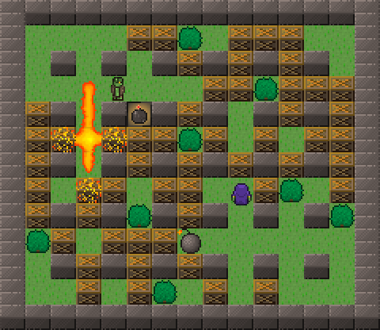

## DynaDungeons

Bomberman clone using the awesome open source [Godot](https://github.com/okamstudio/godot) game engine (MIT-licensed), and using the nice [Bomb Party tileset](http://opengameart.org/content/bomb-party-the-complete-set) from OpenGameArt (CC BY 3.0).

The project is at an early stage of development; the first objective is to reimplement the well-known gameplay of games of the Bomberman series. A further objective might be to extend the gameplay by adding RPG elements and maybe different multiplayer modes such as Capture the Flag.

Those are mostly ideas so far, and this is a learning project to get familiar with Godot and game development, so don't put your hopes too high. ;-)

### Compilation

This repository contains the scenes, scripts and assets that compose the game when used in the Godot game engine. You need at least Godot 1.1stable to play the current development branch. You can either download precompiled binaries for the engine (see [Godot's website](http://godotengine.org/)) or build the engine [from source](https://github.com/okamstudio/godot).

To play the game, simply start Godot engine from DynaDungeons' repository, or import the project in the editor and click "Play". If you compiled or downloaded Godot's export templates, you can also export the game to the platform of your choice (Linux, Windows, Mac OSX, Android, etc.).

### Licensing

All non-binary files in this repo are licensed under the GNU General Public License version 3 or later (GPL 3.0+). The full text of the license is given in the [LICENSE.txt](LICENSE.txt) file.

All sprites (PNG files) are under the Creative Commons Attribution license version 3.0 (CC BY 3.0), please refer to the [CREDITS.md](CREDITS.md) file for details.

All fonts are under the SIL Open Font License version 1.1 (OFL 1.1).
